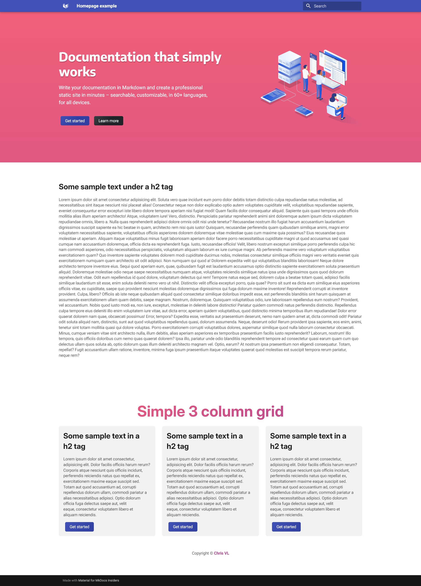

## Understanding theme extending

In order to create your custom homepage it's important to know how theme extending and partials works.
A simple guide can be followed at [Material for Mkdocs](https://squidfunk.github.io/mkdocs-material/customization/#extending-the-theme).

### Setup of homepage
In order to show your homepage we need to set it up first.

--steps--

1.  ### Home.html

    In case you've set your `mkdocs.yml` file up with `custom_dir: overrides` make a folder called 'overrides' in case you haven't yet.
    Within that folder create a home.html file, copy the contents below and paste it in your {++home.html++}

    === ":octicons-file-code-16: `home.html`"

    ```html
    {#-
        This file was automatically generated - do not edit
    -#}
    
    
        {{ super() }}
        <link rel="stylesheet" href="{{ 'assets/stylesheets/home.css' | url }}">
    
    
        {{ super() }}
        <style>.md-header{position:initial}.md-main__inner{margin:0}.md-content{display:none}@media screen and (min-width:60em){.md-sidebar--secondary{display:none}}@media screen and (min-width:76.25em){.md-sidebar--primary{display:none}}</style>
    
    ```


2.  ### The home.css file

    If you paid attention to the {++home.html++} file that we just created you've seen one line that loads a 'home.css' file:

    `<link rel="stylesheet" href="{{ 'assets/stylesheets/home.css' | url }}">`
    
    This file doesn't exist yet so let's add it.
    Go to `overrides/assets/stylesheets` and create a file named {++home.css++}. If you don't have the stylesheets folder then make it as well.
    Note that this isn't in your docs folder but your custom overrides folder.

3.  ### Setting up the index.md

    In order to show our homepage we need to specify it in our index.md file first, this let's the theme know we want to render our {++home.html++} instead of index.md. Paste the following in your index.md file:

    === ":octicons-file-code-16: `index.md`"

    ```md
    ---
    template: home.html
    ---
    ```

--!steps--

## Let's give the homepage some content and styling
Currently we have a homepage set up but it's empty, in order to show content we need to put some content inside the {++home.html++} file.
I recommend making use of [Django Template Language](https://docs.djangoproject.com/en/5.1/ref/templates/language/), this will prevent you from having
a long code in your html file and rather set up different sections. For this documentation we'll keep it simple for now.

--steps--

1.  ### Homepage structure

    Between `` and `` we can write our html structure, see it as your `<body></body>` tags in a normal html file.

    I'd recommend wrapping everything in a custom container class, you can copy the code below or create your own.

    === ":octicons-file-code-16: `home.html`"

    ```html
    {#-
        This file was automatically generated - do not edit
    -#}
    
    
        {{ super() }}
        <link rel="stylesheet" href="{{ 'assets/stylesheets/home.css' | url }}">
    
    
        {{ super() }}
        <style>.md-header{position:initial}.md-main__inner{margin:0}.md-content{display:none}@media screen and (min-width:60em){.md-sidebar--secondary{display:none}}@media screen and (min-width:76.25em){.md-sidebar--primary{display:none}}</style>
        <div class="lp-container">
            <section class="lp-layer hero">
                <div class="hero-wrapper">
                    <h1>This is the name of my homepage</h1>
                    <p>This text will be a small description of my website.</p>
                    <a class="button" href="#">Click me</a>
                </div>
            </section>
        </div>
    
    ```

    You now have a very basic hero section structured with html, you can put almost anything you want inside `lp-container`.
    The reason i went with the name "lp-container" is so it stands out from the material theme names (these usually start with md or mdx).
    in our case "lp" is short for "Landing Page" which is a popular term used in web development.

2. ### Styling with some css

    Right now our homepage looks like something from the first time i opened a html file back in the 90's.
    Let's style up some basic things with the classes we created in the html file.

    _If you have experience with css i highly recommend you look into css variables[^1]_

    === ":octicons-file-code-16: `home.css`"

    ```css
    .lp-container {
    background-color: #fff;
    height: 100vh;
    }

    .lp-layer {
    background-color: #23424A;
    display: block;
    padding: 80px 0;
    }

    .hero-wrapper {
        width: 80%;
        max-width: 900px;
        margin-inline: auto;
    }

    .hero h1 {
    font-size: 3rem;
    font-weight: 700;
    color: white;
    margin-bottom: 32px;
    line-height: 1.2;
    max-width: 35ch;
    }

    .hero p {
    font-size: 1.3125rem;
    color: hsla(0, 0%, 100%, 0.85);
    margin-bottom: 64px;
    font-weight: 400;
    line-height: 1.5;
    max-width: 65ch;
    }

    .button {
    font-size: 1.3125rem;
    padding: 20px 48px;
    background: #38CFD9;
    outline: inherit;
    border: inherit;
    border-radius: 1000px;
    text-transform: uppercase;
    color: #23424A;
    font-weight: 700;
    line-height: 1;
    }

    .button:hover {
    background: #136C72;
    }  
    ```

    Now ofcourse this isn't pretty but you'll get the idea. I'll provide a example homepage later in this article.
    but right now we have something looking like this:

    

3.  ### Adding more things to your hompage

    You can now add almost anything you want in your homepage now (as long as it's html/css/js valid).
    What you do is up to you, this is just a basic example. Your homepage can be any website without a header, navigation & footer.
    Unless you want a custom footer ofcourse that's possible too.

    A good landing page is a combination of various sections, a example of this is[^2]:

    

    One tip is giving every section it's own `<section> // </section>` tags, with a class name like we used "lp-layer" and a second one that makes it unique to the section you're using it for, for example: `<section class="lp-layer about"> // </section>`.
    
    This way the "lp-layer" class will apply to every section but any changes made to the .about class will only be applied to the content inside the "lp-layer about" section. 

4. ### Remember that i told you about Django Template Language?

    What you've made so far can be put into it's own html file called `hero.html` for example.
    Then load this file in yout `home.html` file using Django. i recommend you made a seperate folder for these or
     you can put them inside the `partials` folder of your custom_dir

    === ":octicons-file-code-16: `home.html`"

    ```html
    {#-
        This file was automatically generated - do not edit
    -#}
    
    
        {{ super() }}
        <link rel="stylesheet" href="{{ 'assets/stylesheets/home.css' | url }}">
    
    
        {{ super() }}
        <style>.md-header{position:initial}.md-main__inner{margin:0}.md-content{display:none}@media screen and (min-width:60em){.md-sidebar--secondary{display:none}}@media screen and (min-width:76.25em){.md-sidebar--primary{display:none}}</style>
        <div class="lp-container">
             <!-- or just "hero.html" if you placed this file in your overrides folder -->
        </div>
    
    ```

--!steps--

## Summary

All that i showed you is a simple replication of the default [material homepage](https://github.com/squidfunk/mkdocs-material/blob/master/material/overrides/home.html).
The only difference is they've used the prefix `mdx` instead of `lp`

What you now should have is a directory like this:

```
.
├─ docs/
│   └─ index.md
├─ overrides/
│   ├─ assets/stylesheets/
│   │   └─ home.css
│   ├─ partials/
│   │   └─ hero.html
│   └─home.html
└─ mkdocs.yml
```

=== ":octicons-file-code-16: `index.md`"

    ```md
    ---
    template: home.html
    ---
    ```

=== ":octicons-file-code-16: `mkdocs.yml`"

    ```md
    site_name: My site
    theme:
        name: material
        custom_dir: overrides
    ```

=== ":octicons-file-code-16: `home.html`"

    ```html
    {#-
        This file was automatically generated - do not edit
    -#}
    
    
        {{ super() }}
        <link rel="stylesheet" href="{{ 'assets/stylesheets/home.css' | url }}">
    
    
        {{ super() }}
        <style>.md-header{position:initial}.md-main__inner{margin:0}.md-content{display:none}@media screen and (min-width:60em){.md-sidebar--secondary{display:none}}@media screen and (min-width:76.25em){.md-sidebar--primary{display:none}}</style>
        <div class="lp-container">
             <!-- or just "hero.html" if you placed this file in your overrides folder -->
        </div>
    
    ```

=== ":octicons-file-code-16: `home.css`"

    ```css
    .lp-container {
    background-color: #fff;
    height: 100vh;
    }

    .lp-layer {
    background-color: #23424A;
    display: block;
    padding: 80px 0;
    }

    .hero-wrapper {
        width: 80%;
        max-width: 900px;
        margin-inline: auto;
    }

    .hero h1 {
    font-size: 3rem;
    font-weight: 700;
    color: white;
    margin-bottom: 32px;
    line-height: 1.2;
    max-width: 35ch;
    }

    .hero p {
    font-size: 1.3125rem;
    color: hsla(0, 0%, 100%, 0.85);
    margin-bottom: 64px;
    font-weight: 400;
    line-height: 1.5;
    max-width: 65ch;
    }

    .button {
    font-size: 1.3125rem;
    padding: 20px 48px;
    background: #38CFD9;
    outline: inherit;
    border: inherit;
    border-radius: 1000px;
    text-transform: uppercase;
    color: #23424A;
    font-weight: 700;
    line-height: 1;
    }

    .button:hover {
    background: #136C72;
    }  
    ```


## Simple homepage template to get you started

As i promised here is a simple template to get you started with your own homepage :smile:<br>
You can download this [zip file](assets/Homepage_template.zip)

Note that this is a simple homepage with a hero section, some content and a 3-column section.
If you're looking for a parallax effect like the original insiders homepage you'd need to research that for yourself.
Unfortunately i don't have time to write a whole article about parallax right now but maybe in the future.

Luckily there's a lot of tutorial and articles out there about parallax scrolling.

<span class="heart">:heart:</span> If this helped you and you want to support me, you can buy me a <a href='https://ko-fi.com/cvanliere' target='_blank'>:coffee: coffee</a>.

[Live demo](homepage-live-demo.md){ .md-button .md-button--primary }



[^1]: Css variables/properties are amazing, you set up colors, font-sizes, or anything you want in the root and it let's you use these variables anywhere in your css. for example: `background-color: var(--my-color);` if you change the `--my-color` variable it changes it everywhere you used it. [Read more](https://developer.mozilla.org/en-US/docs/Web/CSS/Using_CSS_custom_properties).
[^2]: The source of this image is [Shopify](https://www.shopify.com/blog/landing-page-design).
